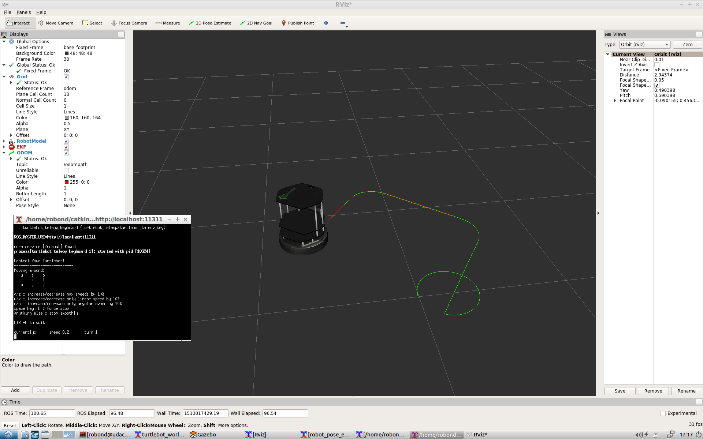

[](https://www.udacity.com/robotics)

# RoboND-EKFLab
Students will be able to drive the robot around in simulation and observe the `Odom` and `EKF` trajectories.  

### Steps to Launch the Simulation:
Launch the simulation in the VM machine provided in Term1. 

#### Step 1 Create a Catkin Workspace:
```sh
$ mkdir -p ~/catkin_ws/src
$ cd ~/catkin_ws/src
$ catkin_init_workspace
$ cd ..
$ catkin_make
```

#### Step 2 Perform a System Update:
```sh
$ sudo apt-get update
```

#### Step 3 Clone the Package in src:
```sh
$ cd ~/catkin_ws/src
$ git clone https://github.com/udacity/RoboND-EKFLab
```

#### Step 4 Install Packages Dependancies:
```sh
$ cd ~/catkin_ws/
$ source devel/setup.bash
$ rosdep -i install turtlebot_gazebo
$ rosdep -i install turtlebot_teleop
```

#### Step 5 Build the Packages:
```sh
$ catkin_make
$ source devel/setup.bash
```

#### Step 6 Launch the main file:
```sh
$ roslaunch main main.launch
```
Now, you should see Gazebo and rviz launching. Please note that Gazebo might take up to 3 min to launch! 


### End Result:
In the terminal, use the keyboard commands(u-i-o-j-k-l-n-m-<) and drive the robot around. The `red` trajectory represents the `Odom path` whereas the `green` trajectory represents the `EKF path`.





